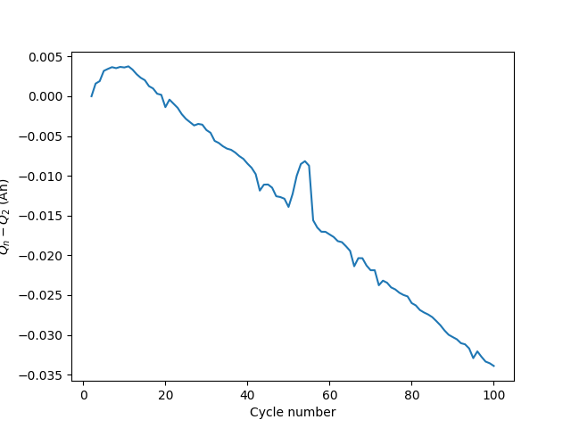
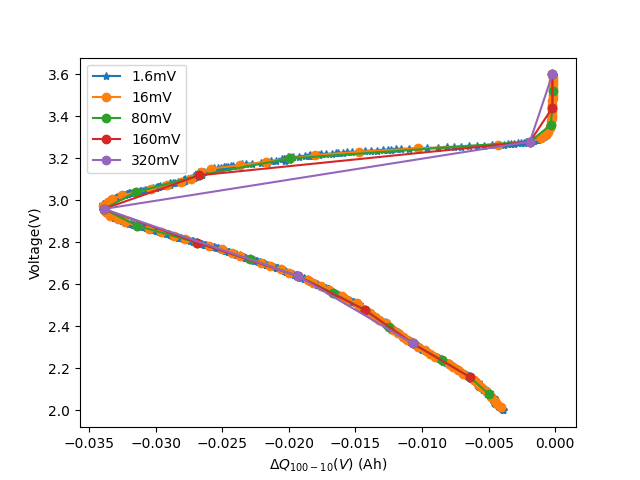
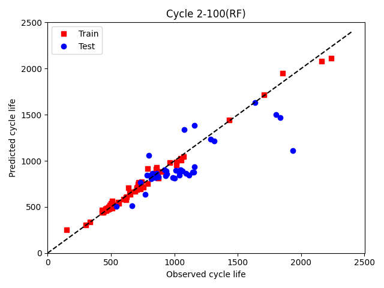
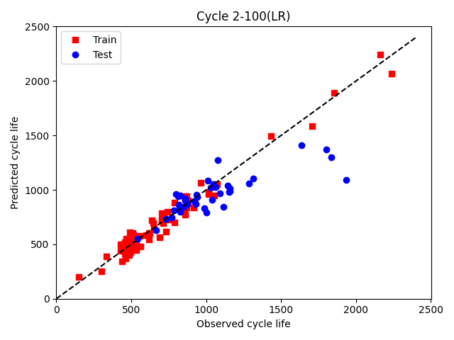
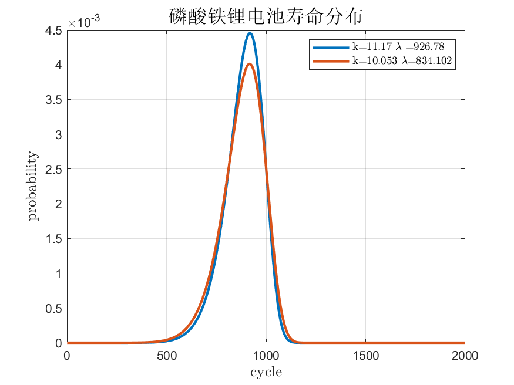
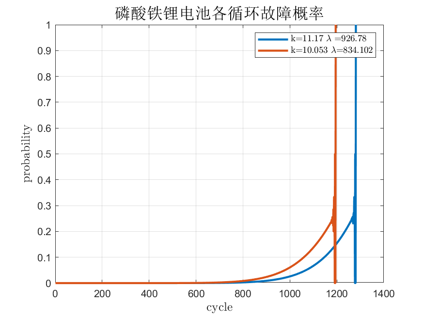
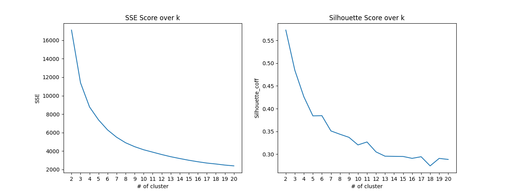

# 风光储荷综合系统预测与模拟

## Background

我国可再生能源资源丰富，以风能、太阳能和水能为主要能源的电力系统是我国未来能源电力的发展形态， 但可再生能源存在间歇性、波动性的短板，而高比例的可再生能源渗透对电力系统安全稳定运行提出了新挑战。微电网(MG)主要由分布式发电机(DG)和储能系统(ESS)组成，为负荷供电。为提高MG中可再生能源供电可靠性，将具有多个电池储能装置的聚合系统定义为电池储能系统(BESS)。用于控制源荷功率平衡，使MG能够以高稳定性和可靠性运行。BESS储存来自RESs的剩余电力，然后在需要时将电力释放给客户 。还有一个挑战是微电网用户之间购买和销售电力，BESS同样可以解决这个难题。

因此，本课程作业希望依次为出发点，争取解决一些风光储综合系统中与人工智能相关的问题。

- 发电侧：光伏出力中直流功率的预测，风力发电直流功率的模拟。
- 储能侧：电池单体的寿命预测，电池储能系统的寿命预测。
- 用户侧：用户用电量的预测，用户用电模式的聚类。

## Libraries

python

- `pandas`
- `numpy`
- `matplotlib`
- `keras`
- `sklearn`
- `PyQt5`

MATLAB

## Content

- data
  - battery_data
  - BESS_data
  - PV_and_wind
  - raw_pvdaq
  - Smart meters in London
- figures
  - battery_figs
  - load_figs
  - PV forecast
- src
  - battery life
  - front end
  - load
  - power forecast
  - reliability

## Power Generation

### Photovoltaic(PV) Prediction

光伏发电系统主要受光照强度、温度等外界环境因素影响。目前对光伏发电系统输出功率的预测方法比较多：

- 数学统计方法：多元线性回归，马尔可夫链，贝叶斯网络

- 人工智能方法：支持向量机，人工神经网络（全连接网络，循环神经网络，transformer等），集成学习方法AdaBoost等。

数据量充足时，使用LSTM，GRU等循环神经网络可以取得较好的预测效果。若数据集非常大，甚至可以使用transformer构造encoder-decoder结构的预测模型。数据量不充分时，使用季节性差分移动平均自回归模型（SARIMA），灰色预测模型等时序预测模型可以取得较好效果。

用三年的数据进行训练，然后用天气特征，预测未来约50小时的光伏阵列直流输出功率。

**raw data**

数据来源：NREL，选用PVDAQ数据集。拉斯维加斯1277站点是一个$40 kW$的光伏阵列，选择其2012年到2014年比较完整的数据（其中2014年仍有较多缺失，采用插值法补充，参考[缺失值处理1](https://towardsdatascience.com/3-ultimate-ways-to-deal-with-missing-values-in-python-ac5a17c53787), [缺失值处理2](https://drnesr.medium.com/filling-gaps-of-a-time-series-using-python-d4bfddd8c460)），原始数据间隔时间为15分钟，包括电压电流、输出功率、天气情况等等。光伏预测仅采用间隔为1小时的数据，因此需要对原始数据进行重新采样，并且需要将3年的数据合并。

选取特征：环境温度、逆变器温度、模块温度、辐照度、相对湿度、风向、风速；输出为光伏阵列的直流输出功率。

**linear regression**

基本原理：以线性模型为基础，训练使得损失函数最小化，损失函数一般选取L2范式即残差平方和RSS。从而得到权重系数$w_i$，利用下式即可对给定特征进行预测。
$$
\boldsymbol{\hat{y}}=w_0+w_1\boldsymbol{x_1}+w_2\boldsymbol{x_2}+...+w_n\boldsymbol{x_n}
$$
数据中给定七个特征，尤其是环境温度和辐照度与预测目标即输出功率有着较强的相关性。因此可以考虑用多元线性回归的方法进行预测。这里的训练数据仅展示最近一段，而非全部。

**LSTM**

LSTM，长短记忆(long short term memory)单元，是一种使用了类似搭桥术结构的RNN单元。它可以学习长期序列信息，是RNN网络中最常使用的Cell之一。相较于上面的多元线性回归方法，LSTM更适合于处理时间序列数据而光伏出力往往具有时序关系，即过去的值对当前和未来的值可能有所影响；另外，LSTM还可以学习非线性模式和复杂的序列关系，并且有长期记忆的机制，能够更好低处理不确定性。

创建一个时间序列模型，首先在模型中添加LSTM层，该LSTM包括64个神经元；

由于训练集数据量(>100k)远大于测试集数据量，因此考虑采取一些防止过拟合的手段，这里采用Dropout的正则化方法，用于缓解神经网络的过拟合问题。在每个训练批次中，Dropout层按一定的比例随机选取丢弃输入数据，使得模型不会过度依赖于某一些神经元。这里选取丢弃比例为0.5。

最后增加Dense全连接层，输出维数为1。

模型评估

- 均方误差$MSE=\frac{1}{n} \sum\limits_{i=1}^n\left(y_i-\hat{y}_i\right)^2$
- 均方根误差$RMSE= \sqrt{\frac{1}{n} \sum\limits_{i=1}^n\left(y_i-\hat{y}_i\right)^2}$
- 平均绝对误差$MAE=\frac{1}{n} \sum\limits_{i=1}^n\left|y_i-\hat{y}_i\right|$
- 决定系数$R^2=\frac{\sum_i(\hat{y_i}-\bar{y})^2}{\sum_i\left(y_i-\bar{y}\right)^2}$

| 评价参数        | Linear Regression | LSTM |
| --------------- | ----------------- | ---- |
| 均方误差MSE     |                   |      |
| 均方根误差RMSE  |                   |      |
| 平均绝对误差MAE |                   |      |
| 决定系数R       |                   |      |

### Wind Power Simulation

由于仅有光伏出力无法满足功率需求，因此在光伏出力的基础上叠加风电。以此为基础，模拟风-光-储混合的微电网系统。风机的输出功率与风速的关系可以用分段函数近似。当风速低于切入风速，$P_{WT}(v)=0$；当风速介于切入风速与额定风速时，$P_{WT}(v)=P_N\frac{v^3-v_{ci}^3}{v_N^3-v_{ci}^3}$；当风速达到额定风速，$P_{WT}(v)=P_N$，当风俗大于切出风速则$P_{WT}(v)=0$

风速预测模型比较经典的有时间序列法中自回归滑动平均模型(ARMA)，另一类方法则是通过概率分布模型来拟合风速概率分布，常用的风速统计模型为Rayleigh分布、Weibull分布、Lognormal分布等等。本作业中，风速选择用双参数Weibull模型模拟，选择$k=2.2$，$\lambda=8$，利用上述关系获得风机组出力情况。其中，风力发电机组的额定功率为$50kW$。切入风速为$2.5m/s$，额定风速为$12m/s$，切出风速为$25m/s$。得到风机出力结果如下。

通过预测加模拟的方式得到了未来50小时内，风-光出力的直流功率输出预测。

## Energy Storage

电池储能系统(BESS)：具有快速充放电，能量密度高，响应速度快，充放电倍数高，建造环境低等优点，可以平滑供电负荷和分布式发电的处理波动，减少其对电网的冲击，同时为分布式发电单元提供备用，有效提高系统的稳定性。

### battery lifetime prediction

准确的电池寿命估计对于电网和电动车中的保修成本估计，减少保修成本的不确定性将降低电池部署的成本。

在电池寿命预测中，最具有预测性的特征是voltage vs capacity或是capacity vs cycle number，内阻以及电池表面温度等等。

数据集来源于[Severson el.](https://www.nature.com/articles/s41560-019-0356-8)，其中包括41 cells的training set，43 cells的test set1，40 cells的test set2。数据集中有前100次循环，每次循环中有电压从3.6V下降到2.0V的1000个容量数据。目的是利用前100个循环的数据预测经对数转换的电池循环寿命。循环寿命被定义为容量低于额定容量的80%之前的循环次数。

可以从下图发现，随着循环次数的增加，在相同的电压水平下，容量逐渐递减；在相同的容量水平下，电压逐渐递减。

画出(1000 voltages × 100 cycles)容量矩阵以及容量衰减曲线如下。

根据[Peter M]()的解释，$\text{var}(\Delta Q_{100-10}(V))$表示电池能量耗散的不均匀程度，而$\log_{10}(\text{var}(\Delta Q_{100-10}(V)))$被证明与电池的循环寿命之间存在良好的线性关系。

每个cell中存在100000个特征量，需要对这些特征进行重新采样、降维。原先容量数据之间间隔1.6mV，可以发现将采样间隔增加到80mV，基本能描述整体的容量与电压的关系曲线，此后一次循环只均匀测量20次容量变化。

在电池寿命预测的研究中有许多有效的机器学习方法，包括岭回归、弹性网回归、主成分回归（PCR）、偏最小二乘回归（PLSR）、随机森林回归，和多层感知器（MLP）。本次作业中采用**随机森林回归**的方法。

随机森林回归算法(Random Forest Regression)通过随机抽取样本和特征，建立多棵相互不关联的决策树，通过并行的方式获得预测结果。每棵决策树都能通过抽取的样本和特征得出一个预测结果，通过综合所有树的结果取平均值，得到整个森林的回归预测结果。

同样地，与多元线性回归进行对比

### battery lifetime simulation

上一部分我们对电池寿命用随机森林回归的方法进行预测，我们只需要得到电池前100个充放电循环中的电气数据即可利用训练好的模型进行寿命预测。我们将预测的寿命当作是当前电池的健康状态，即SOH(State of Health)新出厂电池为100%，完全报废为0%。

此时相当于SOH变为可预测的，我们可以优先使用SOH高的电池，将所有电池的SOH趋于一致。有[文章](https://www.ijert.org/research/predicting-reliability-of-lithium-ion-batteries-IJERTV3IS080846.pdf)指出可以用Weibull分布模拟电池单体的寿命分布，其中磷酸铁锂（LFP）电池的参数可以设置为$k=11.17$ 和 $\lambda=926.78$。考虑到随着电池单体/电池串的故障退出，其他电池单体/电池串需要承受更大的放电功率，损耗加快，因此随着故障电池数量的增加，对电池寿命的概率分布进行实时修正。
$$
f(t)=(\frac{k}{\lambda})(\frac{t}{\lambda})^{k-1}e^{-(\frac{t}{\lambda})^k} \\
F(t)=1-e^{-(\frac{t}{\lambda})^k}\\
R(t)=1-F(t)=e^{-(\frac{t}{\lambda})^k} \\
\lambda(t)=\frac{f(t)}{R(t)}=(\frac{k}{\lambda})(\frac{t}{\lambda})^{k-1}
$$
有$F(t)=P(T\le t)$，$R(t)=P(T>t)$，因此$P(t_{i-1}<T\le t_i)=F(t_i)-F(t_{i-1})$，此处用到的故障概率定义为，$t_{i-1}$时刻健康，但$t_{i}$时刻故障的概率，根据条件概率公式，
$$
P(t_{i-1}<T<t_i|T>t_{i-1})=\frac{P(t_{i-1}<T\le t_i)}{P(T>t_{i-1})}\\
=\frac{F(t_i)-F(t_{i-1})}{R(t_{i-1})}
$$
每次充放电循环中，健康电池的故障率为：$P_i=\frac{F(t_i)-F(t_{i-1})}{R(t_{i-1})}$，也就是对累积分布函数做差分，再除可靠度。

可以发现，电池故障概率在超过1200后甚至降低，这是因为到后面可靠度$R(t)$变为零，$F(t)$的差分也为零，出现了零除零的情况，因此实际上我们只采用1150之前的故障概率数据，在充放电循环次数超过1150之后，保持线性缓慢上升。如果不进行此修正，无论循环次数多大，最后总会剩下~500各电池。

修正后的磷酸铁锂电池故障概率如下

可以看到，随着电池故障数增加进行实时修正后，电池“真实”寿命的分布稍微偏移了原先设置的威布尔分布，这是因为我们的修正使得电池损耗更快，故障概率增加，因此寿命分布也会整体左移。

### BESS lifetime calculation

对BESS各个battery module进行全生命周期的抽样模拟，以电池充放电循环次数作为其寿命，在每个充放电循环下根据上一个充放电循环故障的电池数量对剩余电池的故障率进行重新评估，计算出故障概率。以此作为该充放电循环下的预期故障概率，继续进行这次抽样。抽样的过程也是利用01随机数与故障概率相比，来判定其在本次充放电循环中是否故障。已经故障的电池将其视为永久退出，后续不再对他进行任何抽样。

这里假设BESS life仅是考虑20%退出工作，BESS已无法提供充足容量与功率。但实际上这个做法是非常粗糙的，考虑到这一细节并非本课程的研究重点，仅以此描述储能系统的故障。

## Load

数据集来源于Kaggle，[Smart meters in London](https://www.kaggle.com/datasets/jeanmidev/smart-meters-in-london/code)。

- `daily_dataset`：统计了每天电能的使用情况，包括总量、平均值、中位数、最大值、最小值、标准差等等；
- `acorn_details`：ACORN指的居民区的一些分类，数据中包含了居民的个人信息。Acorn 用于了解消费者的生活方式、行为和态度，以及社区的需求，对私营部门和公共服务组织都很重要。它用于分析客户、确定盈利前景、评估当地市场并关注每个流域和社区的具体需求；
- `household_info`：包含了家庭的所有信息；
- `weather_daily` and `weather_hourly`：包含了阴天的信息。

数据来源于英国伦敦的智能电表，利用这些数据来训练负荷预测模型，并且结合ACORN来更好地了解个人住宅的消费模式。

### load prediction

负荷预测的意义在于能够及时动态调整电价，从市场影响消费者，抑制部分用户过度用电；并且协助制定未来的发电计划。负荷的预测同样用到LSTM神经网络，与光伏出力类似，居民的用电负荷往往也具有时序关系。

居民用电负荷预测如下图所示：

### load clustering

[ACORN ](https://en.wikipedia.org/wiki/Acorn_(demographics))A Classification Of Residential Neighborhoods  作为一种英国伦敦的人口统计工具，将家庭、[邮政编码](https://en.wikipedia.org/wiki/Postcodes_in_the_United_Kingdom)和社区划分为 6 个类别、18 个组别和 62 个类型。利用K-means聚类对用户电力消耗的行为进行聚类，找到用户的 “energy fingerprint”。K-means 是一种无监督的机器学习算法，其中集群的数量必须先验定义。由于数据收集源于智能电表，早期数据有许多家庭的数据都是缺失的，我们选择大部分家庭都有数据的日起开始计算，并且删除数据仍然缺失的家庭。

解释不同经济水平的用户的消费模式，验证ACORN与用电模式之间的相关性。首先采用PCA方法提取主特征，提取为用电量总量以及用电量最大值，也就是这两个特征最能保留最大的数据信息。

撇除ACORN不典型的第6类居民：not private households，则ACORN对居民的分类变为5个类别(categories)，17个组别(groups)，我们首先以5-means and 17-means来对居民用电模式进行聚类。聚类结果如下：

对聚类效果的评估指标选取轮廓系数：

- 簇内平方和：随着聚类数k的增大，样本划分会更加精细，每个簇的聚合程度会逐渐提高，那么误差平方和SSE自然会逐渐变小。并且，当k小于真实聚类数时，由于k的增大会大幅增加每个簇的聚合程度，故SSE的下降幅度会很大，而当k到达真实聚类数时，再增加k所得到的聚合程度回报会迅速变小，所以SSE的下降幅度会骤减，然后随着k值的继续增大而趋于平缓。
  $$
  SSE=\sum^{k}_{i=1}\sum_{p\in C_i}\left|p-\mu_{i}\right|^2
  $$

- 轮廓系数(Silhouette Coefficient)，得分由两部分组成，一是样本与同一个簇中其他点之间的平均距离（记为a）。二是样本与下一个距离最近的簇中其他点的平均距离（记为b），根据公式计算出单个样本的轮廓系数，然后计算整组的轮廓系数平均值。
  $$
  s=\frac{b-a}{\max (a,b)}
  $$
  簇越紧凑且分离度越高时，轮廓系数越大。

试图选择出最佳簇数k，参考[How to Determine the Right Number of Clusters](https://towardsdatascience.com/how-to-determine-the-right-number-of-clusters-with-code-d58de36368b1)。采用第一种方法#1: Within-Cluster Sum of Squares (WSS)，遗憾的是，这些数据似乎并没有出现比较明显的所谓的“拐点”（左图）；采用第二种方法#2 Average Silhouette Score（右图），可以发现轮廓系数最高的k<10依次为2、3、4、6、5......，用电量**最**能反映社会的贫富2个阶层的差距，后续可能是6个阶层分数更高一些；对于k>10，轮廓系数得分比较高的为11、10、12、13......。

虽然试图利用K-means聚类来验证伦敦居民的ACORN类型划分似乎不太可行，但本工作仍具有意义。居民类型划分并不是及时更新的，我们或许可以通过居民的用电模式聚类来试图寻找新的划分，可能有原先的Affluent Achievers以及Rising Prosperity因为投资失败破产，或是原先的Urban Adversity获取了大量财富，那么原先的分类无法反应他们当前的类型，而用电量能够反映当下比较真实居民类型划分。
